Container image for whois - intelligent WHOIS client

## Usage

### Run a WHOIS query

```shell
docker run --rm -it ghcr.io/r-xs-fi/whois example.com
```

Outputs:
```console
   Domain Name: EXAMPLE.COM
   Registry Domain ID: 2336799_DOMAIN_COM-VRSN
   Registrar WHOIS Server: whois.iana.org
   Registrar URL: http://res-dom.iana.org
   Updated Date: 2023-08-14T07:01:38Z
   Creation Date: 1995-08-14T04:00:00Z
   Registry Expiry Date: 2024-08-13T04:00:00Z
   Registrar: RESERVED-Internet Assigned Numbers Authority
   Registrar IANA ID: 376
   Registrar Abuse Contact Email:
   Registrar Abuse Contact Phone:
   Domain Status: clientDeleteProhibited https://icann.org/epp#clientDeleteProhibited
   Domain Status: clientTransferProhibited https://icann.org/epp#clientTransferProhibited
   Domain Status: clientUpdateProhibited https://icann.org/epp#clientUpdateProhibited
   Name Server: A.IANA-SERVERS.NET
   Name Server: B.IANA-SERVERS.NET
   DNSSEC: signedDelegation
   DNSSEC DS Data: 370 13 2 BE74359954660069D5C63D200C39F5603827D7DD02B56F120EE9F3A86764247C
   URL of the ICANN Whois Inaccuracy Complaint Form: https://www.icann.org/wicf/
>>> Last update of whois database: 2024-04-15T10:25:14Z <<<
```

## Supported platforms


| OS    | Architecture  | Supported | Example hardware |
|-------|---------------|-----------|-------------|
| Linux | amd64 | ✅       | Regular PCs (also known as x64-64) |
| Linux | arm64 | ✅       | Raspberry Pi with 64-bit OS, other single-board computers, Apple M1 etc. |
| Linux | arm/v7 | ✅       | Raspberry Pi with 32-bit OS, older phones |
| Linux | riscv64 | ✅       | More exotic hardware |

## How does this software get to me?

```mermaid
flowchart TD
    subgraph "Origin"
        sourcerepo["Original source repo"]
    end
    subgraph "Alpine infrastructure"
        Alpine_build[Alpine build machine]
        Alpine_package[Alpine package registry: whois 🔗]

        click Alpine_package "https://pkgs.alpinelinux.org/package/edge/community/x86/whois"
    end
    subgraph "Packaging build"
        rxsfi_build["r.xs.fi build (GitHub Actions)"]
    end
    subgraph "Container Registry"
        r_xs_fi_package_registry[ghcr.io/r-xs-fi/whois 🔗]

        click r_xs_fi_package_registry "https://ghcr.io/r-xs-fi/whois"
    end
    subgraph "user"
        docker_run[$ docker run ...]
    end
    sourcerepo -- downloads --> Alpine_build -- stores --> Alpine_package
    Alpine_package -- download --> rxsfi_build
    rxsfi_build -- push --> r_xs_fi_package_registry
    r_xs_fi_package_registry -- pull --> docker_run[$ docker run ...]

```


